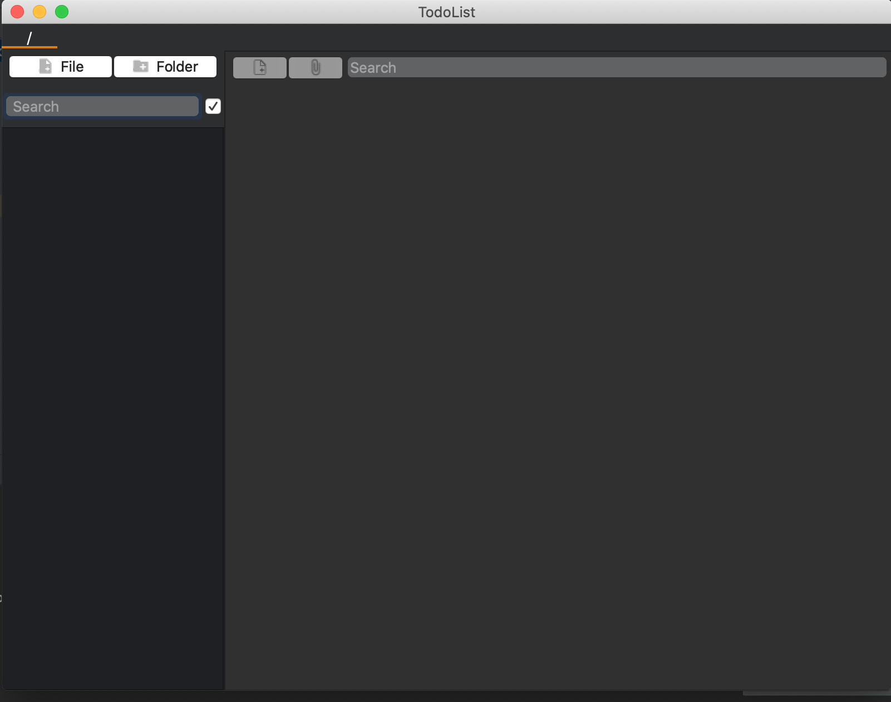
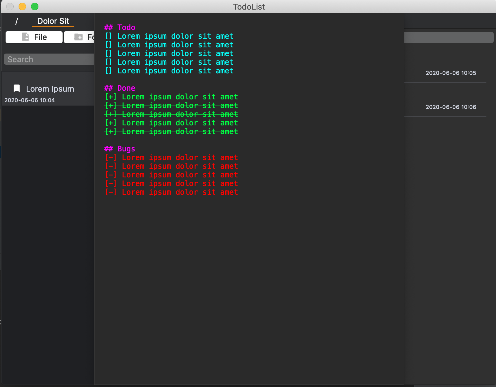
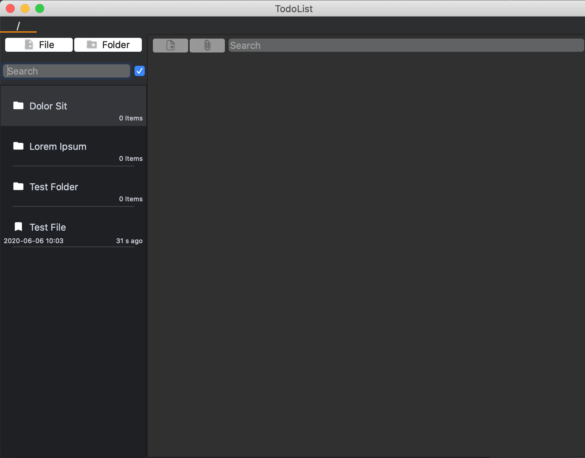
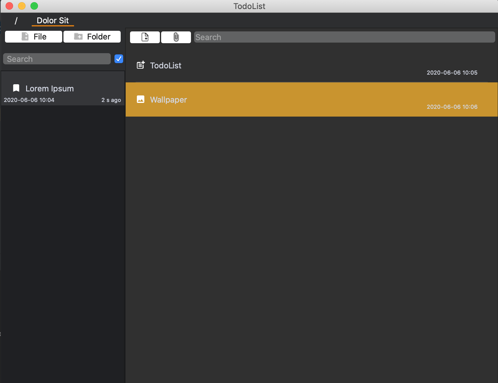
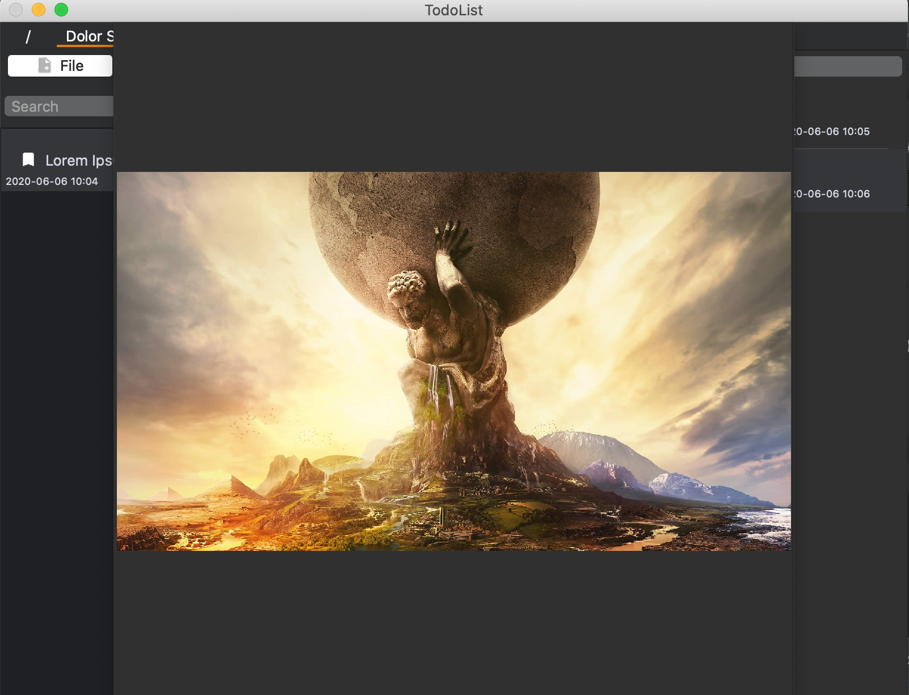

## Kiwi Application Using QT Framework
This is a general purpose data storage application. 












## Requirement
- Python 3
- PySide2 == 5.11.0
- fbs

## Install
```
pip install -r requirements.txt
```
## Usage
```
fbs run
```
## Standalone Application
```
fbs freeze;
```