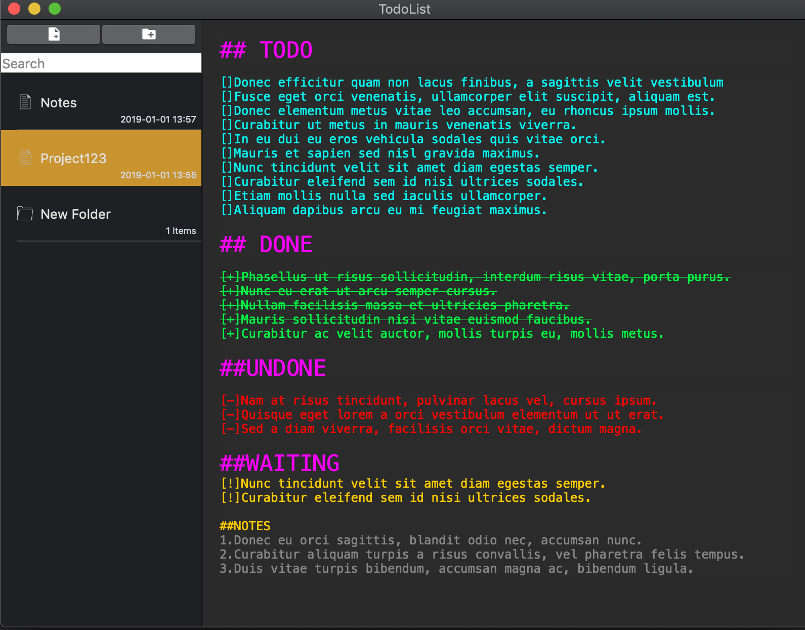
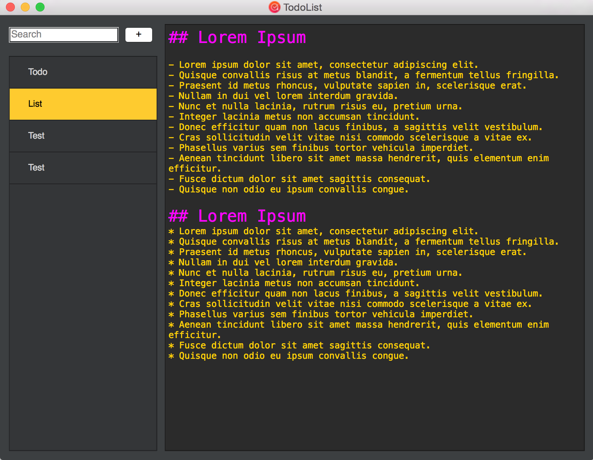
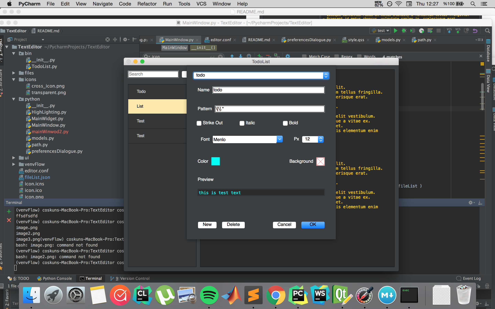

## Todo List Application Using QT Framework
This is a todolist application. 







## Requirement
- Python
- Qt4.8
- PySide

## Install

[Qt4.8 Install](http://doc.qt.io/archives/qt-4.8/installation.html)

[Python 2.7](https://www.python.org/downloads/)

```
pip install PySide
```
## Usage

```
python bin/TodoList.py
```